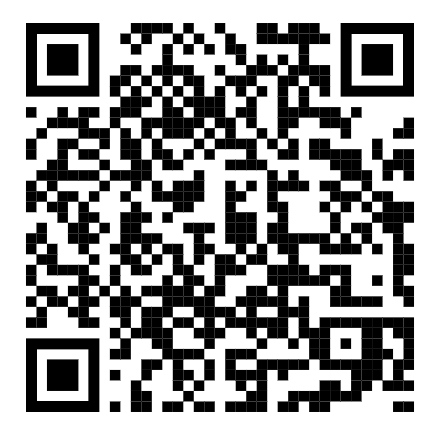

# How to set up ODK Collect

The Bohemia project uses "ODK" (Open Data Kit), a suite of open-source software tools optimized for questionnaire-based data collection in low-connectivity settings. The android/tablet app for data collection is called "ODK Collect". This guide explains how to install it.

## Installation

- Get an android device and an internet connection.
- Scan the below QR code

- (Alternatively, click [here](https://play.google.com/store/apps/details?id=org.odk.collect.android) or open the Google Play store and search for "ODK Collect")
- Click "Install"

## Configuration

Now you need to associate your device with the project's server. In order to do so:

- Open "ODK Collect"
- Click "Configure with QR code"
- Scan the QR code provided to you by the project
- After scanning the QR code, you are ready to begin collecting data

(As an example, click [here](img/recontesting.png) for a QR code which will allow you to test the "recon" forms)

## Data collection

- On the main menu, click "Fill Blank Form"
- Select the form you'd like to complete
- Complete the form
- The form will be submitted as soon as you have an internet connection

For more details see, [the official ODK Collect documentation](https://docs.getodk.org/collect-install/).