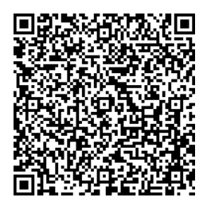

# ODK Collect

The Bohemia project uses "ODK" (Open Data Kit), a suite of open-source software tools optimized for questionnaire-based data collection in low-connectivity settings. The android/tablet app for data collection is called "ODK Collect". This guide explains how to install it.

## Installation instructions

To carry out the below installation instructions, you'll need an android device and an internet connection.

- Open the Google Play store
- Search for "ODK Collect"
- Install "ODK Collect"

## Configuration

Now you need to associate your device with the project's server. In order to do so:

- Open "ODK Collect"
- Click "Configure with QR code"
- Scan the QR code provided to you by the project

As an example, the below is a QR code for testing the "recon" forms (_NOT TO BE USED FOR REAL DATA COLLECTION_).

For more details (complete, official documentation), see [here](https://docs.getodk.org/collect-install/)