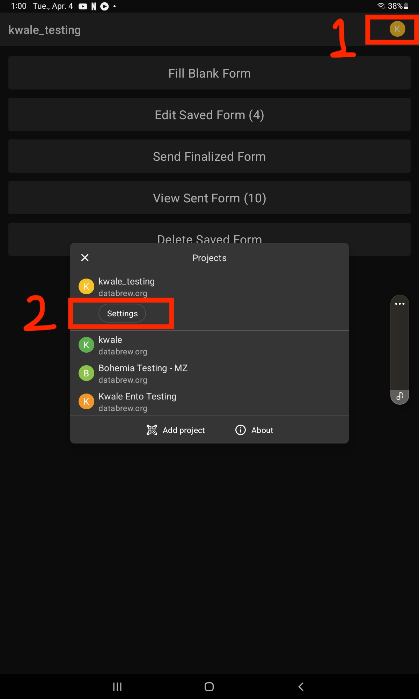
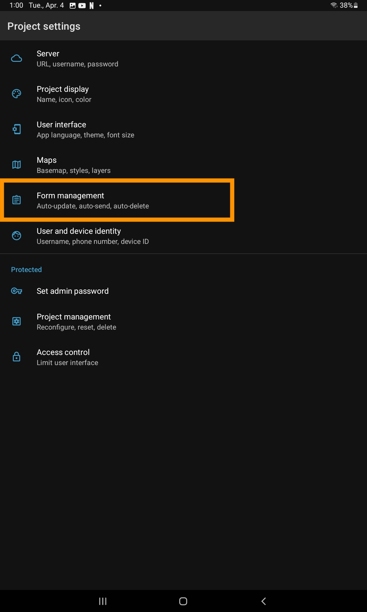
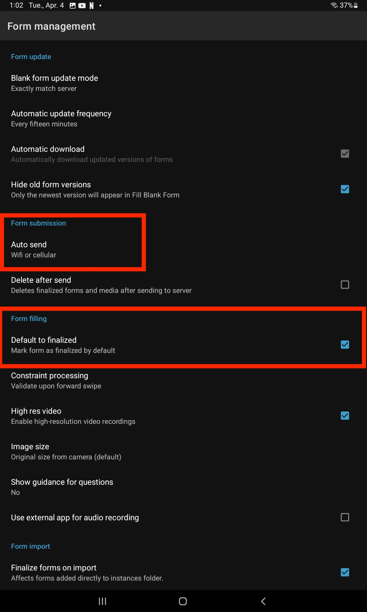
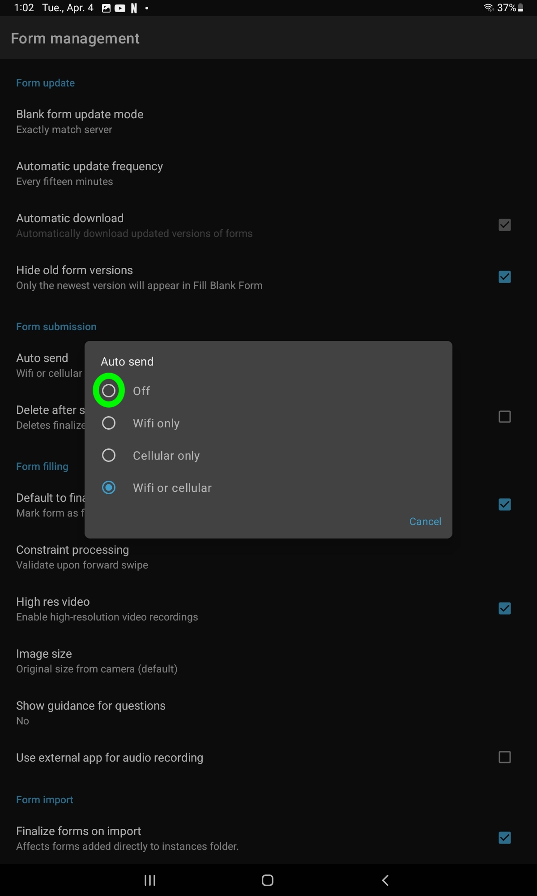
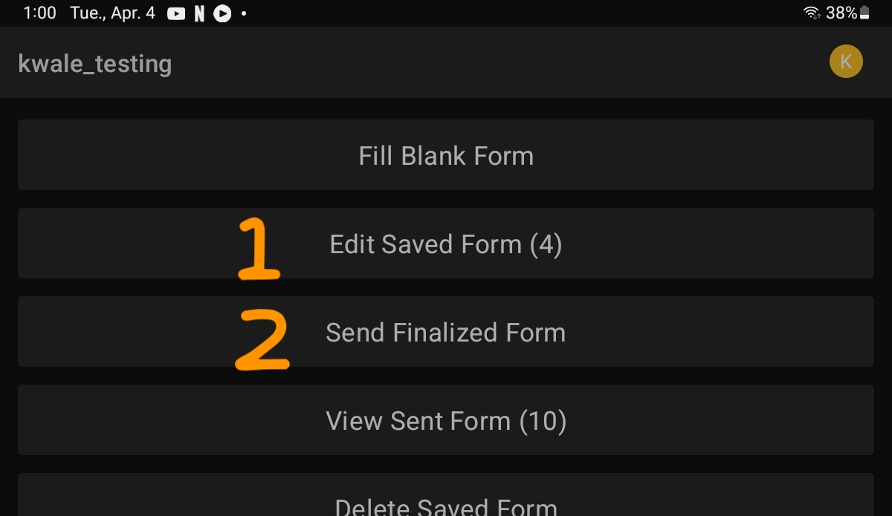

# How to disable the Auto Send function in ODK Collect

ODK Collect's default settings result in completed questionnaire forms to be "Finalized" and "Sent" to the sever automatically. The data collection needs for the Bohemia project in Kwale require that forms are NOT automatically sent to the server so that fieldworkers can save forms before they are completed and return to a form to complete it at another time (such as in the case of Safety cohort absences or Ento lab data that needs to be entered over a few days).

Each tablet will need to be configured to disable the automatic finalization and sending of forms. To do so:

1. Click the project icon at the top right of the screen and then the Settings buttons in the popup window. 

2.  Click on the "Form Management" link.  

3.  In the Form Management screen, (1) uncheck the "Default to Finalize" button and (2) click on "Auto Send".

4. Once you click "Auto Send", a popup window will appear. Check the radio button "Off"<br

5. Your settings have now been changed. You must now manually check the "Finalize" button at the end of each form once it is finalized. 

- To edit an incomplete saved form, click "Edit Saved Form" and click on the form you need to edit (1).
- To send forms to the sever once they have been completed, on the project home screen, click "Send Finalized Form" (2). The number in parentheses is the number of forms that have been saved but not yet sent to the server. 

