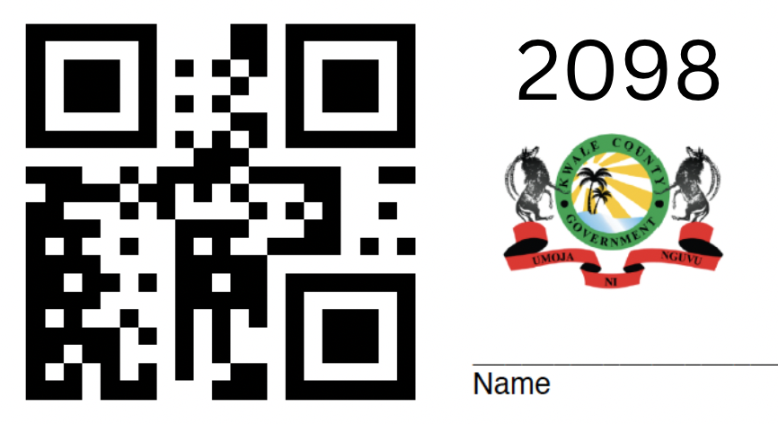

# Reconnaissance Kwale (aka Recon)

### Overview

In October 2022, “Recon” activities will take place in Kwale. The main purposes of Recon are to:

- Register the CHAs (supervisors) and CHVs (fieldworkers) that will be involved in the project by providing each with a unique worker ID and collecting information about where they work, and 
- Collect basic information about households in the study area.

###  Worker Registration

Each CHA and CHV requires a unique worker ID as a way to be identified in the study. 

QR codes have been generated by Databrew that correspond to the numbers 2000-2999. The project team in Kwale has printed and laminated QR code cards and will distribute one each to the CHAs and CHVs involved in this project. 

Each CHA will complete a **CHA/CHV Registration Form** (an ODK form to be filled out on an Android device) in which she will enter her name and scan the QR code she has been provided, as well as answer questions about the ward, community unit (CU), and villages within her area of supervision. 

Each CHV will also complete a **CHA/CHV Registration Form** in which she will scan the QR code she has been provided, answer questions about where she works, as well as scan the QR code (or manually enter the worker ID) of her CHA. 

Once the registration process has been completed, each CHA and CHV will have a unique 4-digit worker ID, each CHV will be linked to a CHA (ie., we will know which CHVs each CHA supervises), and we will have obtained data about where each of the CHVs works. 

### Household Data Collection

Once all the CHVs have been registered, they will visit all the households in their work area and collect data about each household’s location, building type, and number of household members in the **Household Registration Form** (ODK form). This information will facilitate cluster creation, which will happen in November 2022 once Recon activities are complete. 
