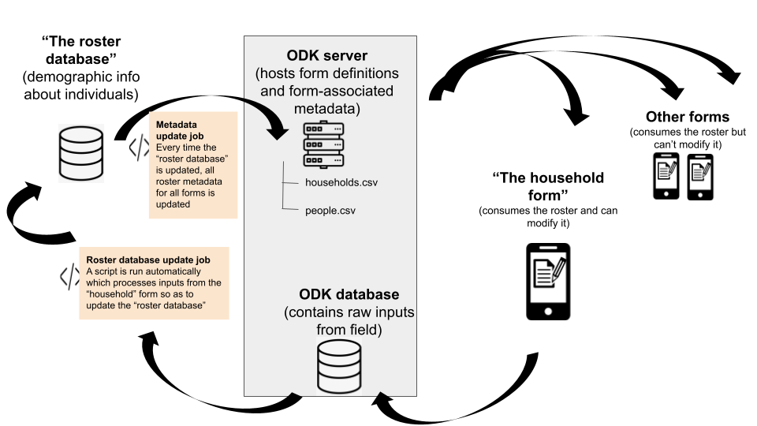

# Proof of concept

## Near real-time demographic management (roster additions, removals, etc.) using a "remote" database

This sub-directory contains code and documentation for testing the feasibility of real-time, continuous updates to a demographic database for the purposes of real-time, continuous updates to metadata used in non-demographic forms, in line with the below proposed schema.

## Pre-requisites

- Deploy an ODK Central server
- Modify, if applicable, this [household google sheet form definition](https://docs.google.com/spreadsheets/d/1bHZMWc3SgrdfTRPlY6oKR__f9ZWhbuhVP0hbzdnFgPw/edit#gid=954023890) or [individual google sheet form definition](https://docs.google.com/spreadsheets/d/1zIp_gmJL0NnjCZ45CRN_cVHOWt2UokjqtiTPuFEv3Lo/edit#gid=0)
- Run the first few lines of `01_update.R` so as to create a `.xml` version of the `household` and `individual` forms from their respective google sheets
- Manually deploy the `.xml`s to your ODK Central server (this step might be automated in the future, but for now, a manual first deploy is required)
- In the ODK Central web application, under `projects` / <your project> / `household` / `Form Access` ensure that the appropriate user has access to the form. Do the same for the `individual` form.

## Instructions

- Run the `01_update.R` script so as to create a pseudo-database of `people` and `households`. The script will upload these files as metadata to the `testing` form.
- Automate the run of the `01_update.R` script via either (a) a loop which `source`s the script or (b) a cronjob. 
- Fill out the form.
- Wait a couple of minutes.
- Check out the form again; the demographic metadata should have been modified in both the `household` and `individual` forms.
