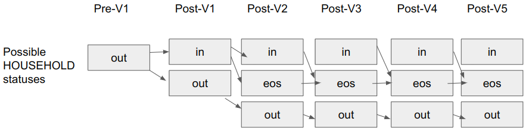
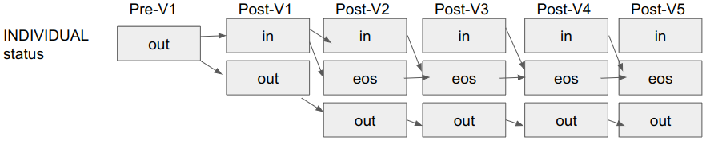

# Metadata for Bohemia Kenya ODK forms

## Context 

The Bohemia Kenya research project relies primarily on ODK as the platform for data collection. The list of the project's ODK forms can be found [here](https://docs.google.com/spreadsheets/d/10fsAAnARFzLqn5OVHgVhxIfPkmplrgir7n7BOGLyhfI/edit#gid=0). ODK XLS-formatted forms can be either (a) stand-alone or (b) reliant on external datasets ([details](https://docs.getodk.org/form-datasets/)). Many of the project's forms are the latter case; they rely on frequently updated, external `.csv` files referred to as "metadata". These files provide information which is necessary for proper form function such as (but not limited to), (i) lists of households to populate a "Select a houseohld dropdown" field, (ii) information about a selected entity (for example, a selected household's cluster number of treatment status, or a selected individual's date of birth), (iii) mutable information about an entity's project affiliation ("pre-selected" for certain components of the trial, "in" a certain cohort, "out" of another cohort, etc.).

Some forms rely on multiple datasets. One can ascertain the list of metadata dependencies for a given form by either (a) searching for calls to `pulldata` or `search` within the `survey` tab of the xlsform itself or (b) uploading the XLSform to an ODK Central server, which automatically carries out this search and prompts the user to upload the relevant metadata files.

Because metadata files condition the flow of the form and the range of possibilities of values to be entered, they should be understand as part of the data collection process; accordingly, it is essential that they be properly versioned and that their values be corrected and inspected.

This document contains basic documentation on the process by which metadata files are created and inspected. Because metadata files are unique to each form, and because each form expects a different (i) name and (ii) schema for each of its metadata files, this document contains separate sections for each of the metadata-reliant project forms.

### Health Economics

#### Forms 

The health economics portion of the study consists of the following individual forms:
- `healtheconbaseline` (Health Economics Baseline)
- `healtheconnew` (Health Economics New Members)
- `healtheconmonthly` (Health Economics Monthly)
- `ntdbaseline` (NTD Baseline)

#### Pre-selections / randomizations

In regards to pre-selection, only 600 households form part of the health economics component of the study, stemming from only 30 clusters:
- The list of health economics clusters is at `analyses/randomization/outputs/health_economics_clusters.csv`
- The list of health economics households is at `analyses/randomization/outputs/health_economics_households.csv`
Some individuals within health economics households are pre-selected to participate in the "NTD" component of the project. The list for the individuals pre-selected for this component of the project are available at:
- `analyses/randomization/outputs/health_economics_ntd_efficacy_preselection.csv`
- `analyses/randomization/outputs/health_economics_ntd_safety_preselection.csv`

The four aforementioned files are generated via the script at `analyses/randomization/randomize.R`. The details on the randomization method are not covered in this document.

#### Metadata files

The metadata for the 4 health economics files can all be generated at `scripts/metadata/generate_metadata.R`. 

- `healtheconbaseline` (Health Economics Baseline) relies on two metadata files. These are written to `scripts/metadata/healtheconbaseline_metadata`:
  - `household_data.csv`
  - `individual_data.csv`
- `healtheconnew` (Health Economics New Members) relies on one metadata file, the aforementioned `household_data.csv`, written to the same folder as mentioned above (ie, the "new members" form does not have its own metadata, but instead consumes the metadata of the "baseline" form):
  - `household_data.csv`
- `healtheconmonthly` (Health Economics Monthly) relies on two metadata files. Though identically named to the prior files, these are not identical copies insofar as they require further filtering. These are written to `scripts/metadata/healtheconmonthly_metadata`:
    - `household_data.csv`
    - `individual_data.csv`
- `ntdbaseline` (NTD Baseline) relies on a file written to `scripts/metadata/ntd_metadata/individual_data.csv`

#### Visit timing

Unlike other components of the study (such as safety), health economics will enroll participants into the study only during the first visit (ie, "visit 1" or "V1"). To enroll participants into the study, fieldworkers use the `healtheconbaseline` and `healtheconnew` forms, which force them to select clusters, households, and individuals which are "eligible" for enrollment in the first place. 

The visit 1 period takes place from mid September through early October. Thereafter, subsequent visits (visit 2 or V2, visit 3 or V3, etc.) can take place. Visit numbers span from 1 through 6. Visits 2 through 6 are handled by the `healtheconmonthly` form. The `healtheconbaseline` and `healtheconnew` forms can be considered deprecated as of early October, once the last "visit 1" takes place.

#### Cohort "status"

##### Household status

Unlike other components of the study, the "health economics" portion of the project has a concept of a "household status". The possible "statuses" of any household are:
- "out"
- "in"
- "eos" 

Each of the 600 pre-selected households has an initial household status of "out". Each individual who lives in any of the 600 households pre-selected for the health economics study has an initial individual status of "out". The below diagram shows the possible statuses for any given household at any given point in the study.

~

All households begin as "out". Following visit 1, a household can be "in" (if enrolled) or "out" (if not enrolled). If not enrolled at visit 1, a household's permanent status will be "out"; unlike in other components of the study, it cannot be enrolled late (for example, at visit 2 or visit 3). Accordingly, as is clear in the above diagram, a household can go from "out" to "in" at visit 1, but once visit 1 is over, a household can no longer go from "out" to "in".

A household which is ever "in" can never go "out". It will either (a) remain "in" or (b) transition to "eos" (end of study) if for some reason the household chooses to no longer participate in the study. 

A household which is ever "eos" can never transition to any other status; once eos, always eos.

A household's "health economics household status" is captured as a string in the `hecon_hh_status` variable, which is part of both the 'healtheconbaseline_metadata/household_data.csv' and the 'healtheconmonthly_metadata/household_data.csv' files.

##### Individual status

As with other components of the study, participants in the "health economics" portion of the project can be considered to form part of a "cohort", ie a group of study participants to be followed longitudinally. The possible "statuses" of any individual are:
- "out"
- "in"
- "eos" (meaning "end of study")
Unlike other cohorts, there is no "refusal" status.

An individual's health economics "status" is conditioned by that individual's _household_ status:
- If a household is "out", all individuals in that household are also "out"
- If a household is "eos", all individuals in that household are also "eos"
- If a household is "in", the individuals in that household can take any status

The below diagram shows the possible statuses for any given individual at any given point in the study.

~

As with households, all individuals begin with an "out" status. If still "out" after visit 1 (the "baseline" period) is finished, that individual remain out forever, and can never transition to "in" or "eos".

Once "in", an individual can never transition to "out". He/she can, however, (a) remain "in" or (b) transition to "eos" at any time. A transition to "eos" may occur at (i) the household level (ie, when a household's "status" becomes "eos", all members of the household inherit that household) or (ii) the individual level (ie, when an individual dies, migrates out of a household, or refuses to continue participation, his/her status becomes "eos", but this does not affect other members of the household).

An individual's "health economics individual status" is captured as a string in the `starting_hecon_status` variable, which is part of both the 'healtheconbaseline_metadata/individual_data.csv' and the 'healtheconmonthly_metadata/individual_data.csv' files.

##### How "status" is handled by each form

When "status" variables exist in metadata files, they refer to the "status" as of the beginning of the visit. The forms consume these files so as to know what the household or person's "status" was at the start of the visit. It could be the case, however, that one's status changes based on information entered in the form. For example, an individual may be "in" at the beginning of visit 2, but refuses to adhere to study procedures, causing him/her to become "eos". In this case, the metadata file for visit 3 will be updated to reflect this "eos" status; however, the metadata file for visit 2 will continue to say "in" for this individual (since it refers to the start of the visit, not the result of the visit). In-form variables reflect an individual's best known status per the form responses (but these are not "metadata" per se).

In addition to correct "status" variables, some of the health economics forms expect filtering to have taken place so that the metadata files contain only certain individuals and households. Details below:

- `healtheconbaseline` and `healtheconnew` consume metadata files in which the "status" variables are set to "out" for everyone. These forms should be filtered down to include only (i) the 600 households which are pre-selected for health economics and (ii) the individuals of those households, as of `v0demography`. These forms are only used at visit 1. The individuals and the households in the `healtheconbaseline` metadata can derive from the "individual" repeat and main form of the `v0demography` dataset, respectively. The households in the `healtheconnew` metadata derive from the `v0demography` main form.
- `healtheconmonthly` consumes metadata whichcontains only individuals whose `starting_hecon_status` is "in". Individuals who are "out" or "eos" should be removed prior to the generation of the file. This is necessary because the form does not handle filtering based on the `starting_hecon_status` variable, and instead expects the rows to be pre-filtered. The individuals in the `healtheconmonthly` dataset dervies from the "individual" repeats of both the `healtheconbaseline` and `healtheconnew` forms.
- `ntdbaseline` consumes metadata derived from `v0demography` and randomizations only. It is unaffected by the "status" of households and individuals as per the `healtheconbaseline`, `healtheconnew`, and `healtheconmonthly` forms. More details below.

#### The NTD quasi-cohort

The NTD component of the project does not conform neatly to the above rules. Though the `ntdbaseline` form consumes identically formatted data as the `healtheconmonthly` and `healtheconbaseline` forms,  an individual's health economics "status" does not affect his/her eligibility for participation in the NTD component of the study ([instruction from project](https://bohemiakenya.slack.com/archives/C042KSRLYUA/p1693302612438699?thread_ts=1693301612.723869&cid=C042KSRLYUA)). An individual who is pre-selected for participation in the NTD component of the project will have his household and individual ID show-up in drop-downs for fieldworkers to select regardless of what occurred previously in the health economics statuses of that individual and his/her household. 

There is no "NTD status" for individuals or households.

#### Comment on script functionality

The `scripts/metadata/generate_metadata.R` script generates the metadata files necessary for the health economics suite of forms. Because the NTD "status" concept does not exist, and because the NTD form's metadata is not dynamic (it is generated once only), the NTD file is written only once. In the metadata generation script, it is written based on all eligible health economics individuals, filtered down only to those who are "pre-selected" for the NTD component of the project. This filtering + writing occurs _before_ filtering for "in" households (which is necessary for the "monthly" forms, since households which are "out" or "eos" should not show up in monthly forms).
