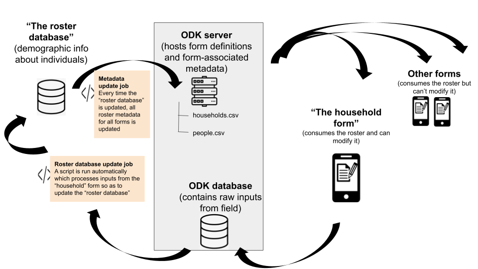

# Testing

This sub-directory contains code and documentation for testing the feasibility of real-time, continuous updates to a demographic database for the purposes of real-time, continuous updates to metadata used in non-demographic forms.

